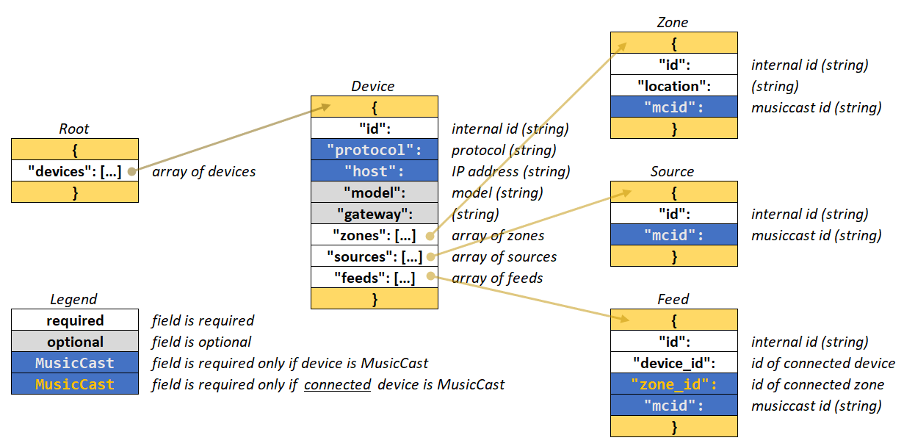
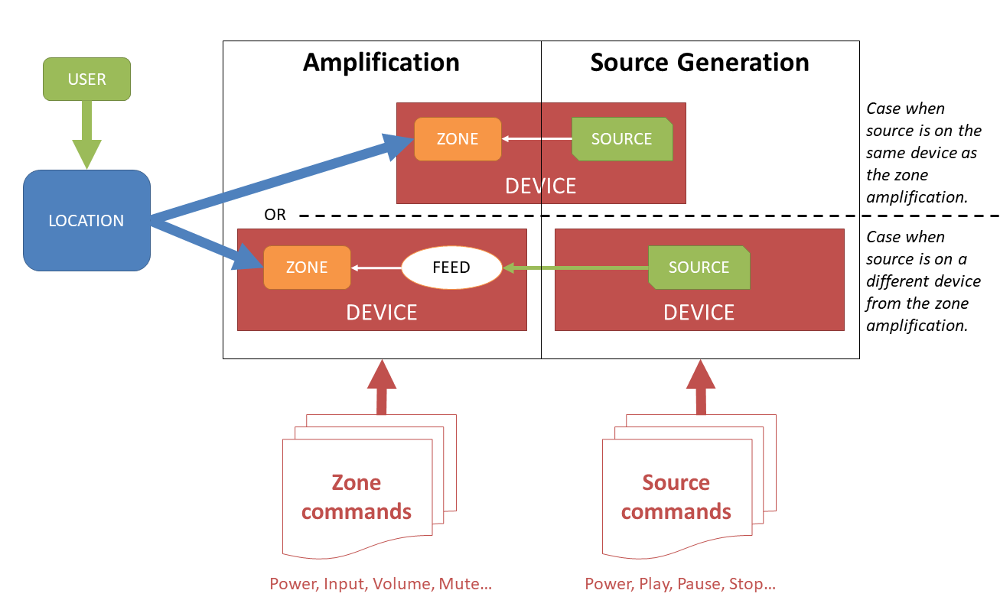

.. This document has been reviewed by Paolo on 24May2018.

**************************
Yamaha MusicCast Interface
**************************

This is a guide on how to get started with the MusicCast to MQTT gateway.
It is part of a wider project based on the library `mqttgateway <http://mqttgateway.readthedocs.io/en/latest/>`_.
Some of the steps to install and configure this interface are described
in more details there.

Introduction
============

The steps to make this gateway work are:

1. Install the application.
2. Update the configuration file.
3. Define your audio-video system in a JSON file (the most important step).
4. Launch the process.

Installation
============

Use the ``PyPi`` repository with the ``pip`` command, with your preferred options (I use
the ``--user`` option but you can set up a virtual environment or install it as super
user system-wide):

.. code-block:: none

    pip --user musiccast2mqtt

The only non-standard dependencies are the ``mqttgateway`` library
and the ``paho mqtt`` library.

The ``pip`` process installs an executable file ``musicast2mqtt``.
Try to run it.  If the ``PATH`` on your system is configured appropriately, it
should start the process with all the default configuration and log some messages
to start with.

If there are any problems, it might be a ``PATH`` issue.  Locate the executable
file in your file system and try to run it by pointing at it directly.  If it still
doesn't work, check the documentation of the ``mqttgateway`` library or leave an issue
on `GitHub <https://github.com/ppt000/musiccast2mqtt/issues>`_.

The location of the installation depends on the options chosen in the ``pip`` command.
Find it in order to use the configuration and other data files as templates.

Configuration
=============

The configuration file ``musiccast2mqtt.conf`` is in the ``musiccast2mqtt`` folder of the
installation.
It can be left there or moved somewhere else, in which case its location will have to be
specified in the argument of the launch command.
Change the MQTT broker details to route the application to your own broker.
Once your system definition file is ready (see below), also include its name and location
in the appropriate option.

Launch
======

To launch the application with the new configuration file, simply add the location and name
as the first (and only) argument to the launch command, for example:

.. code-block:: none

    musiccast2mqtt musiccast_sysdef.json

If the argument given is an absolute path then there is no ambiguity.  If it is a relative path,
the application will look first in the current directory and then in the installation directory
(the directory of the launch script ``musiccast_start.py`` to be precise).

Defining the audio-video System
===============================

It would be nice to have a self-discovery process that finds out what are the devices
available online and what are their characteristics.  The Yamaha API provides some
functionality to do that.
However this would only work if all of the devices were *connected*
with the same protocol. Even then, some essential information would be missing like, for example,
what device is physically connected to a given input on a receiver.
This interface aims to work in a realistic environment where not all devices communicate
via MusicCast, or do not even *communicate* at all.  In this case, writing a system
description is an unavoidable step.

This **system description** defines all the devices available, some of their characteristics
and their connections.
In practice, it is a JSON formatted file.
A template is provided as well as a JSON schema to test it.

The structure of the system description partly reflects the system representation used by the
MusicCast API.  For example all device have zones, even if they are *pure players* and have
no amplification (e.g. the Network Player CD-NT670D).

The system description also introduces a distinction between *inputs* of receivers: those that are
native *sources*, i.e. where the audio signal is *produced* on the same device (a **tuner** for example),
and those that are simple audio inputs, or *feeds*, where the audio signal actually
comes from another device (a separate CD player for example).

For further explanations of the reasons behind those distinctions and other design choices,
go to the :ref:`Data Representation <musiccast_datarepresentation>` section.

The format of the system description is therefore made of an array of **devices**, each with
a small set of characteristics (their IP address for example), and 3 arrays within each device
defining their **zones**, **sources** and **feeds**.
All zones, sources and feeds have an *internal* **id**, and, if the device is a MusicCast
enabled device, an **mcid** which is the name of the zone or input as defined by the
MusicCast API. It is important to keep those **id** separate even if they can be the same.
The internal **id** is used for various code logic,
whereas the **mcid** is used to send the actual HTTP commands to the MusicCast devices.
For more details, see :ref:`musiccast_naming`.

**Zones** have one important characteristic: the **location** that they power.
A zone will generally be defined as an amplifying stage of a receiver, connected
to speakers located in a specific room or area.
The **location** of the zone will be this room or area.
This has to be a one-to-one relationship throughout the system, except for the
zones that are not *proper* zones (the *pure players* case) and for which the location
is set to an empty string.

**Sources** do not have extra characteristics, but their
**id** has a particular use in the *command dispatch* mechanism and so it needs
to be chosen with care.  See :ref:`musiccast_naming` for more details.

Finally each **Feed** need to specify the external device that is connected
to it.  If that device is MusicCast enabled, then the specific zone to use for the commands
within that device needs to be specified as well.

The exact schema is as pictured below.

Use the template ``musiccast_sysdef_template_json.py`` to get started (shown below).
Follow the instructions in the comments, remove all comments and the first line (it's there to
make it look like a python file) and save it with the name of your choice (``musiccast_sysdef.json`` for example). Make sure it is a proper JSON file:
the extension has to be ``json`` and it should be validated with the JSON schema provided ``musiccast_sysdef_schema.json``.  Use an online validator like `this one <https://www.jsonschemavalidator.net/>`_, and select the schema ``Schema Draft v7``.

.. literalinclude:: ../../musiccast2mqtt/musiccast_sysdef_template_json.py
    :language: python

Finding your MusicCast identifiers
----------------------------------
The easiest way to find out the various identifiers of your MusicCast devices is to *manually*
make some HTTP requests and look at the replies in a browser.
For instance, assuming the device IP address is 192.168.1.11, then type in the address bar of your
browser the following request:

.. code-block:: none

    http://192.168.1.11/YamahaExtendedControl/v1/system/getFeatures

and look at the JSON structure that the device sends back.
Firefox does a good job at showing the structure nicely.

.. _musiccast_naming:

Naming Devices, Zones, Sources and Feeds
========================================

Device, Zone, Source and Feed are all classes in the application.
All need to have their **id** specified in the system definition so that they can be
uniquely identified by the application.  They are used extensively for logs and messages,
and are also part of the logic in a few cases.  In particular:

- the Device **id** is used to identify a device if it is defined in an incoming message;
  so if an incoming message specifies the *device* characteristic, the engine will looking
  for this device by comparing the id in the system description and the name given in
  the message (which might be the result itself of a conversion from the original MQTT
  message via a mapping; check the ``mqttgateway`` documentation for more details).
- the Source **id** is used to find the right source to play a given source selected by the
  user.  There are a few sources pre-defined in the available commands: **cd**, **tuner**,
  **net-radio**, **spotify**.  The devices that have such sources should have their **id**
  set to these same names so that the application logic can locate them.
- the Zone **id** and Feed **id** are not used by the application logic and are only there for
  messages and logs.

.. note::

    Writing the system description properly is an essential step of the process.
    It might be more difficult that expected if one does not understand how the
    code works.  Do not hesitate to leave an issue on GitHub if you are having difficulty
    with this step.

.. warning::

    What follows are really developper notes.

.. _musiccast_datarepresentation:

Data Representation
===================

Yamaha API view
---------------

The Yamaha documentation does not provide explicitly its view of how to
represent a MusicCast audio-video system, but the way commands are
organised gives a good indication.

The MusicCast API separates commands in groups called ``system``, ``zone``,
``tuner``, ``cd`` and ``netusb``.  As a reminder, the syntax of an HTTP request
to the MusicCast API is ``_base_url_/YamahaExtendedControl/_version_/_group_/_command_``.

The ``system`` identifier represents the commands that are related
to the whole physical device, its network settings and its overall features.
These will be mostly used during initialisation.

The ``zone`` identifier represents the commands that are related *usually* to the amplification
functionality of the device: switching the power on or off, operating the volume,
or selecting which input to play.
They are defined in the Yamaha API by the identifiers ``main``, ``zone2``, etc..
Note however that the MusicCast API always
requires a **zone** to select inputs, even if the device has no physical *zone* in
the usual *amplifier* sense.  This means that MusicCast devices that have no amplification,
called here *pure players* like a CD player or a Network Player, still have a zone,
which is usually (*always?*) ``main``.

Finally the ``tuner``, ``cd`` and ``netusb`` identifiers represent the commands that operate
those sources.  Those identifiers have all similar, but not identical, commands
(to play the source, stop it, forward it...).

From these identifiers we derive the following representation that fits the Yamaha API.

Interface view
--------------

 The whole audio-video system is represented by a tree structure in the interface.

 .. image:: musiccast_datarepresentation.png
    :scale: 50%
    :align: center

System
^^^^^^

At the highest level we define a :py:class:`System` object that represents the whole audio-video
set-up.  There is a unique :py:class:`System` object (a singleton) for the interface
and it is the *root* of the tree.
Its branches are all the devices involved in the audio-video system which are, in a
way or another, connected to each other.

.. note::

  The term **System** is the most appropriate for what is being represented, but
  unfortunately it does not correspond to the **system** identifier in the MusicCast
  API (which is actually a **Device** object in our representation).

Devices
^^^^^^^

A :py:class:`Device` object represents a single physical unit, with a unique **id** and
most importantly a unique IP address (if it is a *connected* device).
Only a few characteristics are defined at the device level (e.g functions available,
version of API, etc...).
Devices can be of all types: pure amplifiers (the device
amplifies an input signal into connected speakers), source generators
(the device acts as a source of audio signal, e.g. CD, network radio,
etc...) or both: a CD player generates an audio signal but doesn't usually amplify,
whereas most AV receivers amplify and act also as tuners, for example.
In the Yamaha API, a :py:class:`Device` object is identified by the qualifier ``system``
in the HTTP requests.

Zones
^^^^^

A device will have one or more **zones**.
As said before, we *could* define a zone as the amplification part of a
device connected to a set of speakers located in a specific area.
Indeed, what is called, for example, a *multiple zones* unit is usually a receiver
that can amplify more than one set of speakers independently.
However the Yamaha API defines zones even for devices that do not provide any
amplification and that are *pure* players (for example the Network CD
Player).  In this case the device has only one zone, even if the *zone*
concept in this case is redundant with the device itself. Because Yamaha
forces us to define these *pass-through* zones, we will distinguish between
amplifying zones and non-amplifying ones in the description of the system.

So every :py:class:`Device` object will have a list of :py:class:`Zone` objects,
the list having at least one element.

The most important characteristic of a :py:class:`Zone` that needs to be specified is
the **location** that the zone is powering.  The relationship between zones and
locations has to be one-to-one, except for *pass-through* zones that should have
their location set to an empty string.

Inputs
^^^^^^

Each device has **inputs**.  These are distinguished between **sources** and
**feeds** (see :ref:`Audio-Video concepts <musiccast_concepts>`).
Each :py:class:`Device` object has a list of :py:class:`Input` objects.
Each :py:class:`Input` object will simply be a *node* in the tree and it has 2
children classes :py:class:`Source` and :py:class:`Feed`.  **Inputs** will only be
instantiated as either **Source** or **Feed**.

The only relevant characteristic of a **Source** is the ``play_info_type``.
This is really a *quirkiness* of the Yamaha API and describing it goes beyond
the scope of this documentation.  Check the code for more information, and the
Yamaha doc, or leave a question.  The good news is that the ``play_info_type`` of
a source can be retrieved from the device with the right request, so nothing has to
be provided by the user in the system definition.

A **Feed** however requires some information from the user, as there is no way to know
what is connected to a certain input on a receiver.  A **feed** therefore contains the id
of the *remote* device (and the zone within that device if that device is MusicCast enabled)
that is connected to that input.

Interface Logic
===============

This section aims to give just an idea of the *core* logic of the interface. It can help to
understand the data representation.

At the most general level of use, the interface has to deal with a system having different types
of devices (MusicCast enabled or not), where each source (from any kind of device) can be played in
different zones (themselves powered by any kind of device).
A zone is operated by a single user, who is in a given location.  The user listens to a source,
and other users from other locations can be listening to the same source as well if they want to.
The interface tries to handle a lot of different cases when processing messages by relying on the
following principles:

- the ``location`` of the message defines the zone to use and the device to operate; alternatively
  the message can directly address the exact ``device`` to operate, which makes things easier but
  requires all potential *senders* to know the devices characteristics.  We will assume this
  doesn't happen very often.

- the ``action`` of the message can be of 2 types: relating to the amplification and therefore
  addressed to the zone, or relating to the source being played and therefore addressed to,
  potentially, a separate device.  For this reason all messages need to be processed fully to see if
  any, or maybe both, of those devices are MusicCast enabled and therefore can be operated by this
  interface.

- if any device involved is NOT MusicCast enabled, there are no ways to know its current state or
  if it is reacting through another interface to the commands being sent by the original sender.
  However this interface will assume that those devices react as expected and will do its part to
  operate properly the MusicCast enabled devices.

.. _musiccast_concepts:

Audio-Video Concepts
====================

This is a general overview of how a general audio-video setup looks like and some derived concepts.

The figure below shows a generic multi-room audio-video setup.  It shows 3 different types of
devices, various locations connected to zones, and the different types of inputs (sources and
feeds).  This is a visual representation of the system defined in the interface.

.. image:: musiccast_multiroomsetup.png
   :scale: 50%
   :align: center

The main notion here to grasp is the way a source can be played.  It may seem obvious that the
actual source can come from the same device as the amplifier or from another device, but
from a *control* point of view they represent two completely different cases.
This is what requires the distinction between sources and feeds as they are both inputs
but represented differently in the interface.

